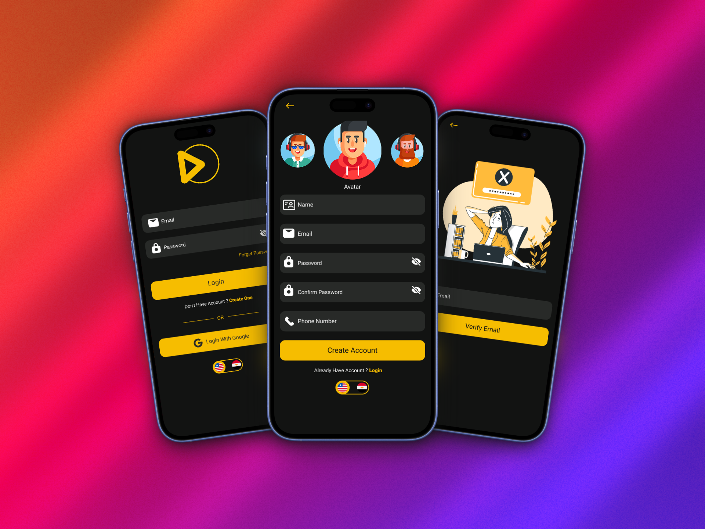
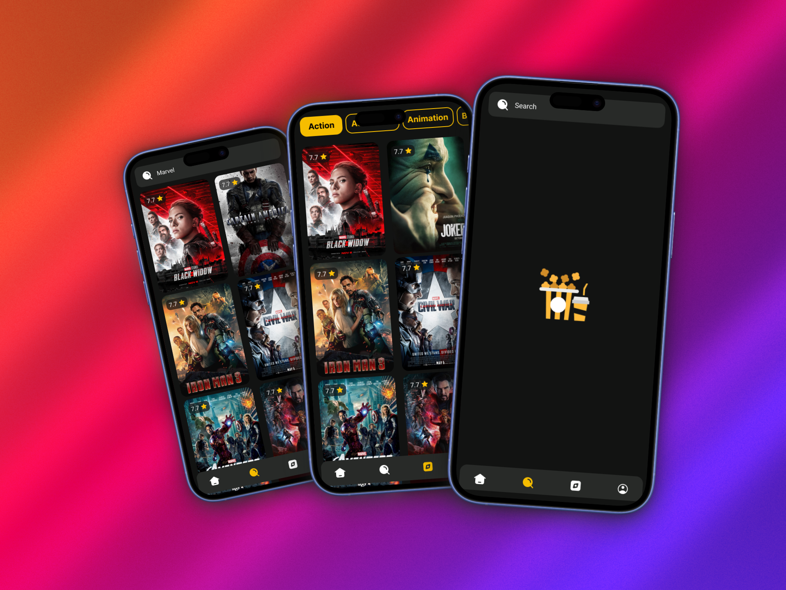
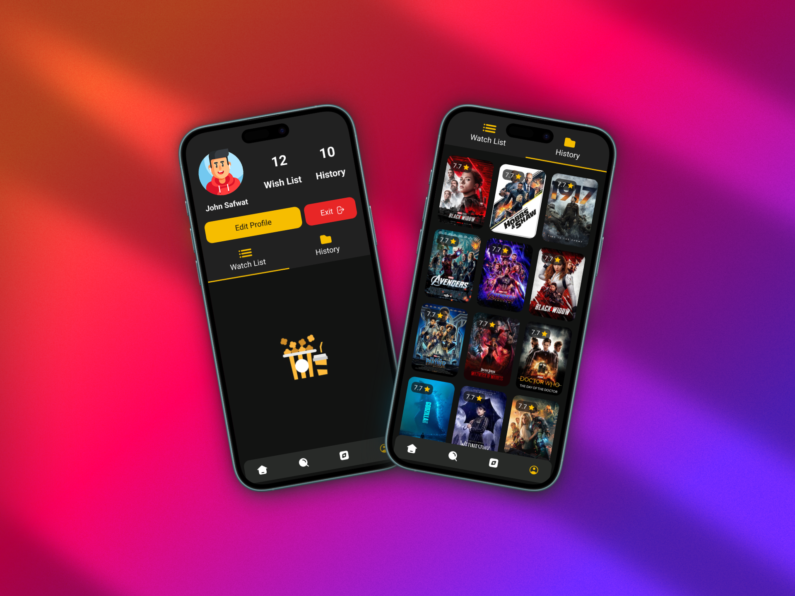

# 🎬 Filmigo

A beautifully designed Flutter application for browsing and exploring the **latest and most popular movies**, built with **Clean Architecture**, **MVVM pattern**, and **BLoC** for state management.

---

## 🌟 Features

- 🔐 **Authentication**
  - Full auth flow: Sign Up, Login, Forgot Password
  - Profile photo selection during registration
  - Reset password and delete account

- 🏠 **Home Tab**
  - Displays **Most Popular Movies**
  - Horizontal carousels for each genre

- 📽️ **Movie Details Screen**
  - View movie info, screenshots, cast, and suggestions
  - Download or open the movie’s external site

- 🔍 **Browse Tab**
  - Powerful **search** functionality for movies

- 🧭 **Explore Tab**
  - Genre-based grid with **infinite scroll (pagination)**

- 👤 **Profile Tab**
  - View personal info, favorites, and watch history
  - Profile update (image, name, email, password)

---

## 🧠 Architecture

- ✅ **Clean Architecture**
- ✅ **MVVM Design Pattern**
- ✅ **Feature-based Modular Structure**
- ✅ **Hydrated Bloc & Offline Support**
- ✅ **Dependency Injection** with `get_it` and `injectable`

---

## 📱 UI Previews

### 🖼️ Onboarding Screens

<table>
  <tr>
    <td></td>
    <td></td>
  </tr>
</table>

---

### 🖼️ Authentication

<table>
  <tr>
    <td></td>
  </tr>
</table>

---

### 🖼️ Home Screen

<table>
  <tr>
    <td></td>
  </tr>
</table>

---

### 🖼️ Search

<table>
  <tr>
    <td></td>
  </tr>
</table>

---

### 🖼️ Profile & Update

<table>
  <tr>
    <td></td>
    <td></td>
  </tr>
</table>

---

## 🚀 Getting Started

### Prerequisites

- Flutter SDK (latest stable)
- Android Studio / VSCode / Xcode
- A connected device or emulator

---

### Installation

1.  **Clone the repository**:

    ```bash
    git clone https://github.com/khalidabdelrazk/filmigo.git
    ```

2.  **Navigate to the project directory**:

    ```bash
    cd filmigo
    ```

3.  **Get Flutter dependencies**:

    ```bash
    flutter pub get
    ```

4.  **Run the application**:

    ```bash
    flutter run
    ```

---

## 🧩 Packages Used

```yaml
dependencies:
  cupertino_icons: ^1.0.8
  flutter_native_splash:
  cached_network_image: ^3.4.1
  carousel_slider: ^5.0.0
  flutter_screenutil: ^5.9.3
  icons_plus: ^5.0.0
  flutter_svg: ^2.1.0
  google_fonts: ^6.2.1
  animated_toggle_switch: ^0.8.5
  bloc: ^9.0.0
  fluttertoast: ^8.2.12
  flutter_bloc: ^9.1.1
  either_dart: ^1.0.0
  connectivity_plus: ^6.1.4
  dio: ^5.8.0+1
  get_it: ^8.0.3
  injectable: ^2.5.0
  shared_preferences:
  http: ^1.3.0
  easy_localization: ^3.0.7+1
  provider: ^6.1.5
  introduction_screen: ^3.1.17
  hydrated_bloc: ^10.0.0
  path_provider: ^2.1.5
  photo_view: ^0.14.0
  url_launcher: ^6.2.6
